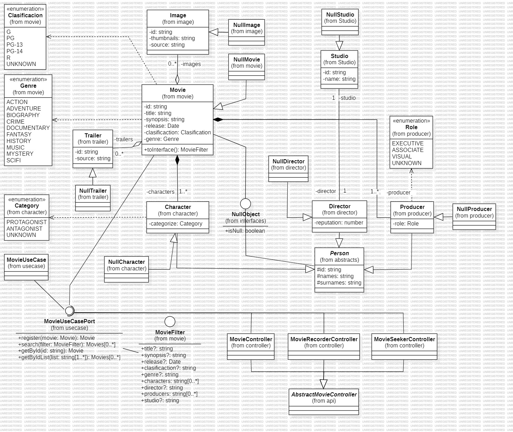

# 🎬 Cinema Management API – Hexagonal Architecture (Ports & Adapters)

This project is a modular **Cinema Management API** developed in **TypeScript**, using **Express** as the web framework.  
It implements a fully structured **RESTful API**, designed to provide clean and consistent endpoints for all cinema-related operations.

The system integrates both **SQL database storage** and **local JSON persistence**, and additionally consumes external data from **SWAPI (Star Wars API)** for movie-related information.

The application is structured using a strict **Hexagonal Architecture** (Ports & Adapters), ensuring high separation of concerns, independence from frameworks, strong modularity, and maintainability.  
The system is divided into **four functional hexagons**, plus a dedicated **API hexagon** responsible for all external communication, and a **Shared Module** that provides utilities and components reused across all hexagons.

## 🛠️ Tech Stack

This project is built using the following technologies:

- **TypeScript** – Strong typing and robust development experience  
- **Node.js + Express** – RESTful API infrastructure  
- **Hexagonal Architecture (Ports & Adapters)** – High modularity and clean boundaries  
- **SQL Database** – Persistent storage for operational data  
- **Local JSON Storage** – Lightweight persistence for specific modules  
- **SWAPI Integration** – External data provider for movie-related information  
- **RESTful API Design** – Consistent and structured endpoint definitions

---

## 🧱 Hexagons Overview

### **1. Movies Hexagon**
Manages movie information. It handles local movie storage and also integrates external data sources such as **SWAPI** to fetch film details, characters, and related metadata.

### **2. Parking Hexagon**
Handles everything related to the cinema's parking system, including vehicle entry, exit, billing calculation, client benefits, and daily revenue reporting.

### **3. Inventory Hexagon**
Responsible for managing inventory items such as food, merchandise, or products sold at the cinema.  
Supports stock checking, item creation, and reservation handling.

### **4. Customer Hexagon**
Handles customer registration, lookup, and identification for benefits such as free parking or personalized services.  
Uses JSON-based local persistence.

### **5. API Hexagon**
Serves as the communication layer between the outside world and the system.  
Contains all Express routing, controllers, and transport-level logic, acting as the **Driver Adapter** for incoming HTTP requests.

### **6. Shared Module**
A cross-cutting module containing reusable utilities, domain abstractions, and infrastructure helpers shared by all hexagons.  
Includes database connectors, JSON managers, error handling, and common value objects.

---

## 🧩 Hexagonal Architecture Diagram

> **Note:** The diagram shows the structure of Domain, Application, and Infrastructure, along with Driver/Driven ports and adapters.

The architecture ensures **high modularity**, **easy testability**, and **clear separation of concerns** across the three main layers:

- **Domain**: Core business logic and entities  
- **Application**: Services and Use Cases (Driver Ports)  
- **Infrastructure**: Controllers, repositories, database, and adapters (Driven Ports)

In addition to this architecture, the system incorporates several **software design patterns**, such as:  
- **Factory Pattern** for constructing complex objects  
- **Nullable Object Pattern** for safe fallback instances  
- **Singleton Pattern** for database connectors and shared resources  

---
## 🎬 1. Movies Module

The **Movies Hexagon** is responsible for managing all movie-related information for the cinema system.  
It combines **local movie data** with external information fetched from **SWAPI (Star Wars API)**, allowing enriched movie records that include titles, characters, and additional metadata.

### 🧩 Movies Diagram

Below is the class diagram representing the internal structure of the Movies module:

Here we can observe the **Movies domain**, with its attributes such as **title**, **synopsis**, **release date**, **genre**, **classification**, **director**, **main cast**, and others.  
The diagram also shows the definition of the corresponding **Domain Port**, the **Use Case** that implements this port, and the **Controller**, which uses the use case through the port to expose functionality to the API.

### 🔌 Available Endpoints (base: `/movies-data`)

- **GET /movie/:id** → Retrieve a movie by its ID  
- **POST /movie** → Create a new movie  
- **GET /list/:idList** → Retrieve a movie list by list ID  
- **GET /list/** → Search for movies using filters (`title`, `type`, `year`, etc.)

---

## 2. 🅿️ Parking Module

The **Parking Module** manages the complete parking workflow of the cinema, handling vehicle entry, exit, billing, client benefits, and daily revenue reporting.  
It is one of the most detailed modules in the system due to its operational and transactional nature.

You can view the full specification of the parking requirements in:  
**`docs/parking-requirements.pdf`**

---

### 🚗 Module Description

The Parking Module provides an endpoint that allows the entrance machine to register a vehicle’s arrival.  
When a vehicle enters, the system stores its **license plate**, **vehicle type** (car or motorcycle), and the **exact timestamp of entry**.  
Additionally, the module enforces parking capacity limits, supporting **38 car spots** and **26 motorcycle spots**.

The module also manages the exit and payment calculation process. When a vehicle attempts to leave, the system checks whether the driver is a **registered store customer**, in which case the parking fee is automatically **waived (payment = $0)**.  
For non-customers, the system calculates the parking fee based on the **total minutes parked**, applies the corresponding **per-minute rate** (car: 88 COP/min, motorcycle: 66 COP/min), and adds the **19% IVA tax**.  
After processing the payment (or determining it is free), the system records the **exit timestamp** and marks the parking session as completed.

The Parking Module also supports generating a **Daily Revenue Report**, which includes the **total revenue collected** on a given date and a **detailed list of all vehicles** that finalized their stay that day. For each vehicle, the report shows its license plate, type, whether it belonged to a store client, and the final amount paid.

### 🔌 Available Endpoints (base: `/api/v1.0/estacionamiento`)

- **POST /ingresos** → Register vehicle entry  
- **POST /salidas** → Register vehicle exit and calculate payment  
- **GET /reportes/balance-diario?fecha=YYYY-MM-DD** → Retrieve the daily revenue report

---

## 3. 📦 Inventory Module

The **Inventory Module** manages all product-related operations within the cinema, including food, merchandise, and other consumables.  
It supports **stock validation**, **item creation**, and **inventory reservation**, ensuring that product availability is accurately tracked and updated.  
You can find the specific design diagram for this module in the **`/design`** folder.

### 🔌 Available Endpoints (base: `/inventory`)
- **GET /items/stock/:sku** → Check stock availability for a given SKU  
- **POST /items/reservations/:sku** → Create a stock reservation  
- **POST /items** → Create a new inventory item  

---

## 4. 🧍 Customer Module

The **Customer Module** handles the identification and management of cinema customers.  
It provides the ability to **retrieve customer information**, enabling features such as **free parking benefits** and personalized experiences.  
This module uses **local JSON persistence** to store and retrieve customer data efficiently.  
The detailed design diagram for this module is available in the **`/design`** folder.

### 🔌 Available Endpoints (base: `/customers-data`)
- **GET /customers/:id** → Retrieve customer information by ID

---

## 🎉 Thank You for Exploring This Repository

Thank you for taking the time to review this project!  
I hope this architecture, the modular hexagon-based design, and the overall system structure provide useful insights into clean backend development with TypeScript.

If you have any suggestions, feedback, or questions, feel free to reach out.  
Your interest and time are greatly appreciated — **may the code be with you!** ✨

